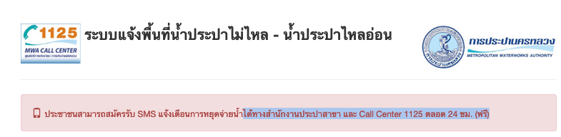

# Water cut notify

Because ain't nobody got time to call a government call center.

## Usage
1. Rename `.env.sample` to `.env` and fill in variables.
2. `docker-compose up`
3. (or running locally) `source .env` && `bash water-cut-notify.sh`
